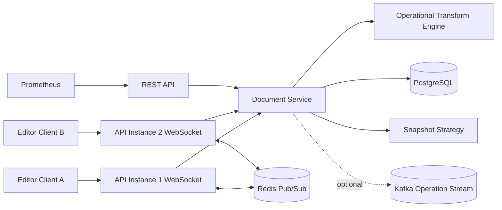
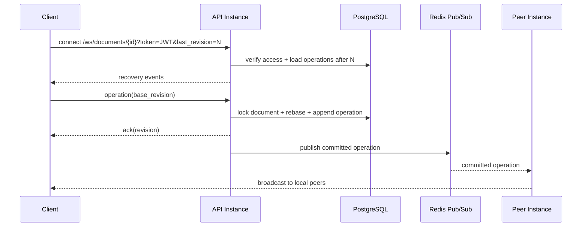

# Collaborative Document Backend

A production-style backend for Google Docs / Notion-like real-time collaborative editing. The project focuses on distributed WebSocket synchronization, server-authoritative Operational Transformation, persistent event sourcing, snapshots, recovery, Redis Pub/Sub fanout, structured logs, and Prometheus metrics.

## Stack

- Python 3.11, FastAPI, SQLAlchemy async, PostgreSQL
- WebSockets for real-time collaboration
- Redis Pub/Sub for cross-instance socket fanout
- Optional Kafka profile for operation-stream expansion
- Alembic migrations, Docker Compose, Prometheus
- JWT auth, structured JSON logging, OpenAPI at `/docs`

## Run

```bash
docker compose up --build
docker compose exec api alembic upgrade head
docker compose exec api python scripts/seed.py
```

API: `http://localhost:8000`

Swagger: `http://localhost:8000/docs`

Metrics: `http://localhost:8000/metrics`

## Architecture



## Data Model

Core tables:

- `users`: identity and password hashes
- `documents`: latest materialized document content and current revision
- `collaborators`: document ACLs
- `document_operations`: append-only operation history
- `document_snapshots`: periodic recovery checkpoints

The database is the source of truth. Redis is used only for low-latency distributed delivery between WebSocket instances.

## OT Strategy

Clients submit plain-text operations with a `base_revision`:

```json
{
  "type": "operation",
  "operation": {
    "type": "insert",
    "position": 12,
    "text": "hello",
    "base_revision": 8,
    "client_operation_id": "c-123"
  }
}
```

The server locks the document row, loads operations after the client base revision, rebases the incoming operation through the OT engine, applies the transformed operation to the materialized content, appends an immutable operation event, increments the revision, and broadcasts the committed operation.

This gives a single global revision order per document while still allowing clients to edit concurrently and recover from stale local state.

## WebSocket Flow



## WebSocket Events

Presence:

```json
{
  "type": "presence",
  "presence": {
    "typing": true,
    "cursor": { "position": 42, "selection_length": 0 }
  }
}
```

Committed operation broadcast:

```json
{
  "type": "operation_committed",
  "revision": 9,
  "user_id": "4b7d...",
  "operation_type": "insert",
  "operation": {
    "position": 14,
    "text": "hello",
    "length": 0,
    "base_revision": 8,
    "client_operation_id": "c-123",
    "transformed": true
  }
}
```

Recovery:

```json
{
  "type": "recovery",
  "operations": [
    { "revision": 7, "operation_type": "delete", "payload": { "position": 2, "length": 3 } }
  ]
}
```

## Synchronization And Scaling

- Each API process keeps only local socket state.
- Every committed operation is persisted before broadcast.
- Redis Pub/Sub distributes events to all API instances.
- Reconnects provide `last_revision`; the server replays missed operations from PostgreSQL.
- Presence is ephemeral and distributed through the same fanout channel.
- PostgreSQL row locks serialize writes per document, avoiding split-brain revision assignment.

## Snapshot Strategy

The system stores every operation as an append-only event, then creates a snapshot every `SNAPSHOT_EVERY_N_OPERATIONS`. Recovery can start from the latest snapshot and replay only newer events. This keeps auditability while bounding replay cost.

## Reliability Tradeoffs

- OT is implemented for linear plain text, not rich block trees. A Notion-style block model would use typed operations per block.
- Redis Pub/Sub is low latency but not durable. Durability comes from PostgreSQL operation history.
- Per-document PostgreSQL locking is simple and correct. Very hot documents can later move to sharded operation sequencers or actor-style document workers.
- Kafka is included as an optional extension point for analytics, audit consumers, or async projections, but the critical write path does not depend on it.

## Useful Commands

```bash
alembic upgrade head
pytest
ruff check .
locust -f scripts/load_test.py --host http://localhost:8000
```

